# 数据源管理

## 功能描述

数据源管理模块用于配置和管理监控数据的来源。系统支持三大类数据源：指标(Metric)、事件(Event)和日志(Log)，为告警判断提供全方位的数据基础。

## 核心功能

### 1. 指标数据源（Metric）
- 支持的存储系统：
  - Prometheus
  - VictoriaMetrics
- 核心特性：
  - 统一的指标查询接口
  - 支持 PromQL 查询语言
  - 实时数据可视化
  - 历史数据查询

### 2. 事件数据源（Event）
- 支持的消息中间件：
  - Kafka
  - RocketMQ
  - MQTT
  - RabbitMQ
- 核心特性：
  - 实时事件处理
  - 消息主题管理
  - 消息持久化
  - 分布式消息追踪

### 3. 日志数据源（Log）

日志数据源提供统一的日志查询和分析接口，支持多种主流日志存储系统，实现日志数据的集中管理、实时检索和告警分析。

### 支持的存储系统

1. **Elasticsearch**
   - 完整支持 ELK 技术栈
   - 强大的全文检索能力
   - 兼容 Kibana 可视化
   - 适用于大规模日志存储和分析

2. **Loki**
   - 基于标签的日志索引机制
   - 与 Prometheus 生态深度集成
   - 优化的存储成本
   - 适用于云原生环境

3. **阿里云SLS**
   - 全托管的日志服务
   - 秒级查询响应
   - 完整的云生态集成
   - 按量计费的商业模式

### 核心功能

1. **日志采集与存储**
   - 多源日志接入
   - 结构化解析
   - 实时数据处理
   - 高效压缩存储

2. **查询与分析**
   - 全文检索
   - SQL分析能力
   - 可视化图表
   - 多维度统计

3. **告警管理**
   - 实时告警触发
   - 复合告警条件
   - 告警降噪
   - 告警通知集成

### 接口定义

```go
// LogDatasource is the interface of log datasource.
LogDatasource interface {
    // QueryLogs queries logs from datasource.
    QueryLogs(ctx context.Context, expr string, start, end int64) (*LogResponse, error)
    // Check checks connection status
    Check(ctx context.Context) error
}
```

### 使用场景

1. **应用日志监控**
   - 错误日志实时告警
   - 性能问题诊断
   - 用户行为分析

2. **安全日志分析**
   - 异常访问检测
   - 安全事件追踪
   - 合规审计日志

3. **运维日志管理**
   - 系统日志集中化
   - 运维操作审计
   - 故障快速定位

### 最佳实践

1. **日志接入规范**
   - 统一日志格式
   - 规范日志级别
   - 合理的日志轮转策略

2. **查询优化建议**
   - 使用精确的时间范围
   - 合理设置查询条件
   - 避免全文模糊匹配

3. **成本优化**
   - 设置合理的保留期限
   - 启用日志压缩
   - 使用索引优化查询

## 使用说明

1. 进入数据源管理页面
2. 选择数据源类型（指标/事件/日志）
3. 选择具体的存储系统
4. 配置连接信息：
   - 服务地址
   - 认证信息
   - 高级配置项
5. 测试连接
6. 保存配置


## 注意事项

- 数据源安全性
  - 使用安全的认证方式
  - 定期更新认证信息
  - 限制访问权限

- 性能考虑
  - 合理设置查询超时
  - 避免大范围数据查询
  - 使用适当的数据采样率

- 可用性保障
  - 定期检查连接状态
  - 配置故障转移机制
  - 监控数据源性能

## 最佳实践

1. 指标数据源
   - 使用 VictoriaMetrics 存储长期指标数据
   - Prometheus 适合实时监控场景

2. 事件数据源
   - Kafka 适合大规模事件处理
   - MQTT 适合物联网场景

3. 日志数据源
   - Elasticsearch 适合全文检索需求
   - Loki 适合标签化日志管理
   - 阿里云SLS 适合云原生场景

# 数据源

系统定义了四种数据类型：日志、指标、事件、 链路。 每种数据类型可以有多种数据存储器。 以这种形式，可以轻松实现数据类型的统一查询、分析、告警、可视化等。

## 指标（Metric）

指标数据源提供统一的时序数据查询和分析接口，支持主流的时序数据库，实现指标数据的采集、存储、查询和可视化。

### 支持的存储系统

1. **Prometheus**
   - 开源的监控告警系统
   - 强大的多维度数据模型
   - 灵活的 PromQL 查询语言
   - 完善的生态系统集成
   - 适用于云原生监控场景

2. **VictoriaMetrics**
   - 高性能时序数据库
   - 兼容 Prometheus 生态
   - 更高的数据压缩比
   - 更低的运维成本
   - 适用于大规模监控场景

### 核心功能

1. **数据采集**
   - 多维度指标收集
   - 自动服务发现
   - 灵活的采集配置
   - 支持自定义 Exporter

2. **查询分析**
   - 实时数据查询
   - 历史趋势分析
   - 聚合计算
   - 多维度分组

3. **可视化展示**
   - 多种图表类型
   - 实时数据更新
   - 自定义仪表盘
   - 灵活的时间范围选择

### 接口定义

```go
// MetricDatasource 数据源完整接口定义
MetricDatasource interface {
    Step() uint32
    // Query 查询数据
    Query(ctx context.Context, expr string, duration int64) ([]*QueryResponse, error)
    // QueryRange 查询数据
    QueryRange(ctx context.Context, expr string, start, end int64, step uint32) ([]*QueryResponse, error)
    // Metadata 查询元数据
    Metadata(ctx context.Context) (*Metadata, error)
    // GetBasicInfo 获取数据源信息
    GetBasicInfo() *BasicInfo
}
```

### 创建

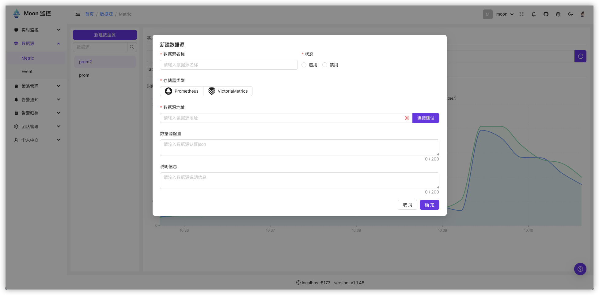

1. **系统监控**
   - 主机资源监控
   - 容器性能分析
   - 服务健康检查
   - 网络流量监控

2. **应用监控**
   - 服务响应时间
   - 请求成功率
   - 业务指标统计
   - 接口调用量

3. **业务监控**
   - 用户行为分析
   - 业务流程监控
   - 关键指标追踪
   - SLA 监控
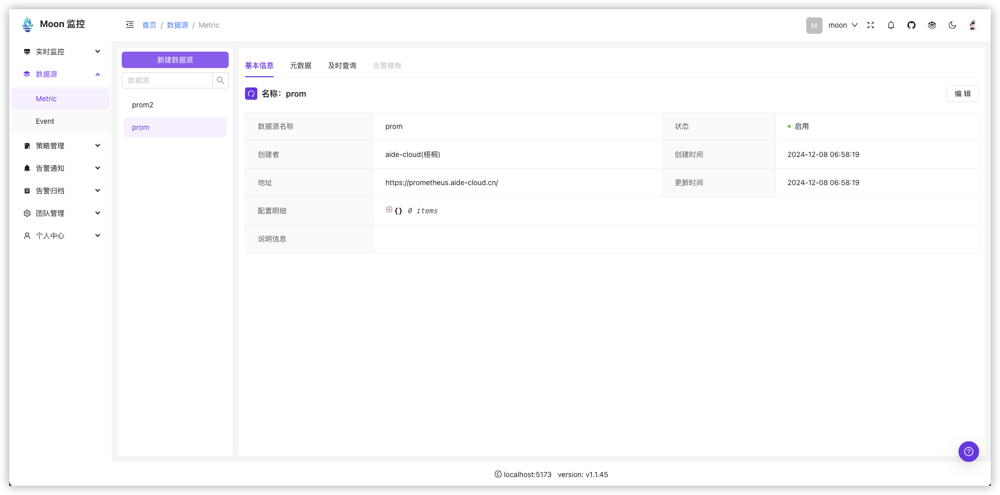

### 元数据

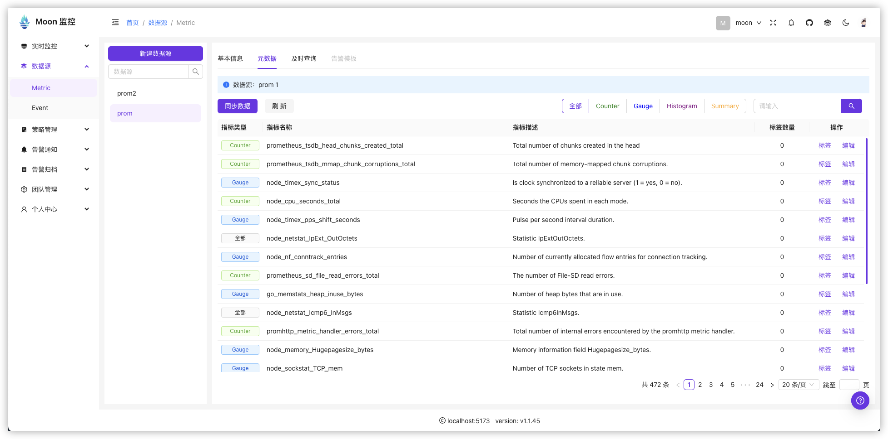

### 查询

:::tip

查询结果支持图表、表格、JSON三种形式。 PromQL 语法参考 [Prometheus](https://prometheus.io/docs/prometheus/latest/querying/basics/)。

输入框支持表达式、函数、变量、常量等语法提示，能帮助用户快速构建查询语句。

:::

* 图表

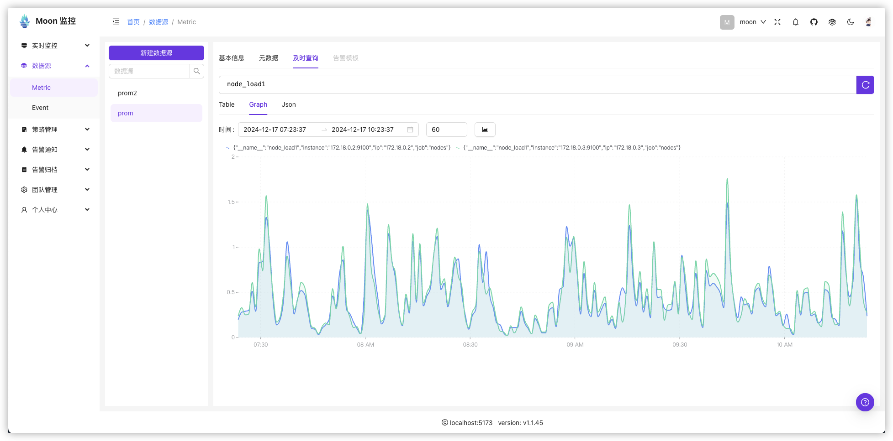

> 查询条件说明, 可以选择时间范围、数据稀疏程度， 图表样式

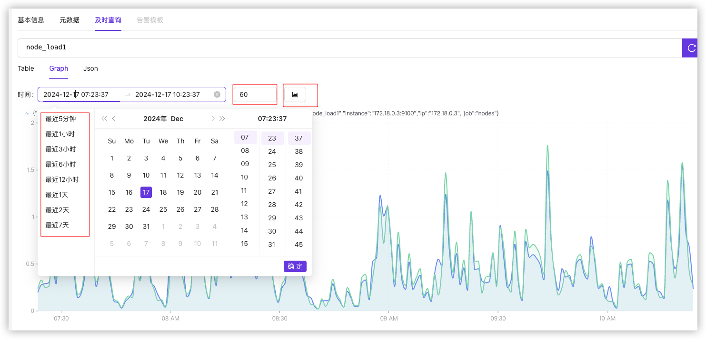

* 表格

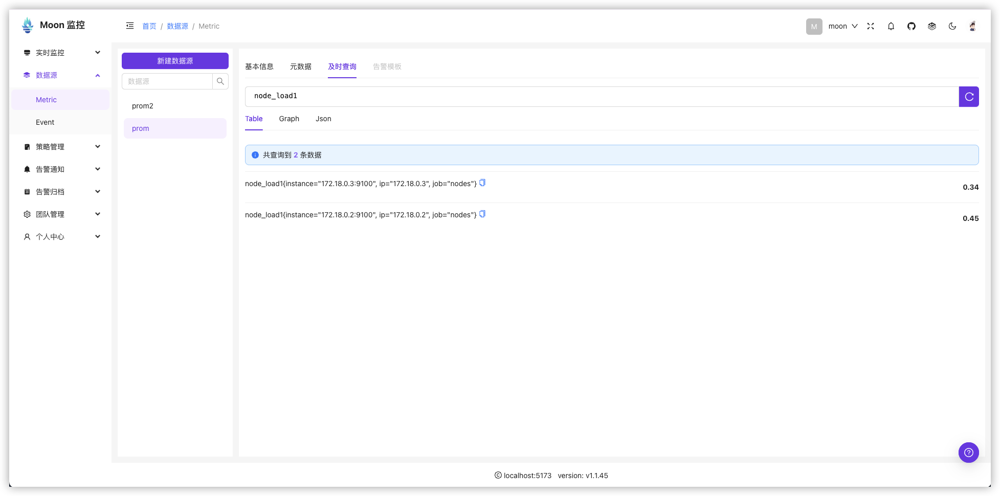

* JSON

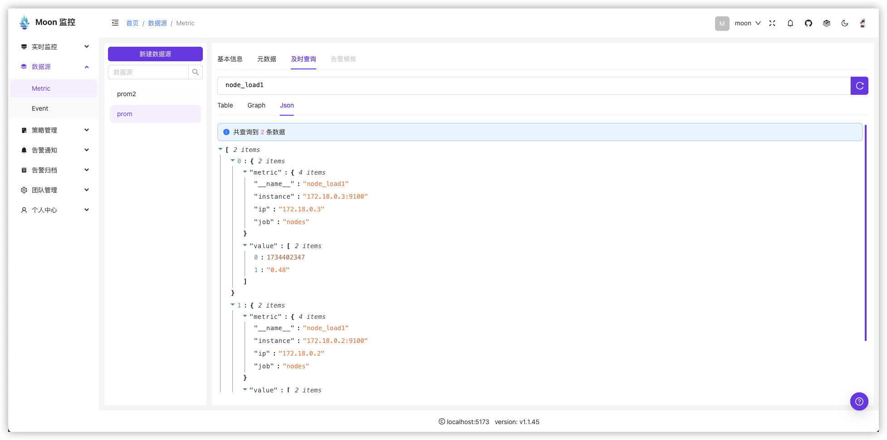

## 事件（Event）

实现统一的事件查询接口，以支持多种事件存储器。 在平台配置统一的事件策略完成事件类型数据的查询、分析、告警、可视化等。

[Kafka](https://kafka.apache.org/)、[RocketMQ](https://rocketmq.apache.org/)、[MQTT](https://mqtt.org/)

```go
// IMQ mq接口
type IMQ interface {
    // Send 发送消息
    Send(topic string, data []byte) error

    // Receive 接收消息 返回一个接收通道
    Receive(topic string) <-chan *Msg

    // RemoveReceiver 移除某个topic的接收通道
    RemoveReceiver(topic string)

    // Close 关闭连接
    Close()
}
```

### 创建

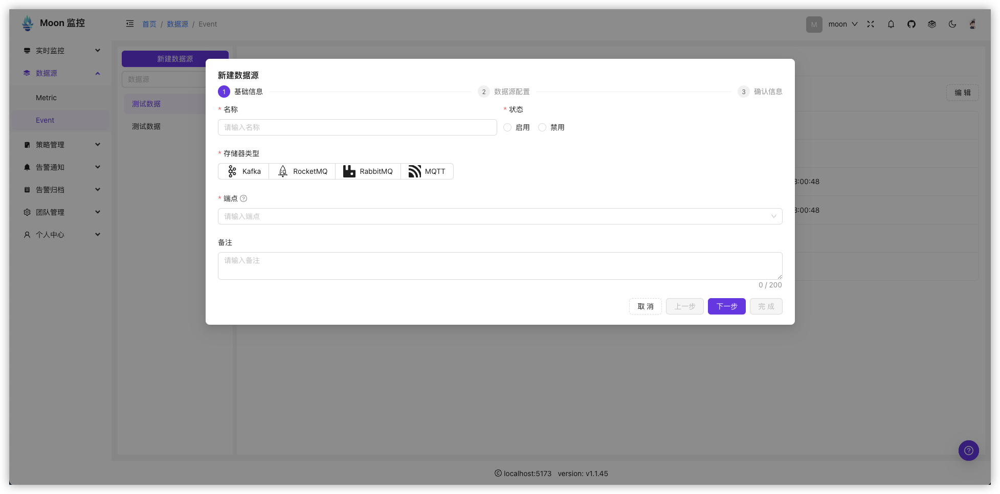

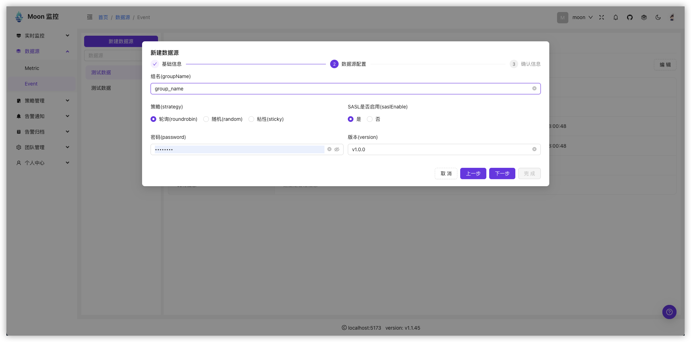

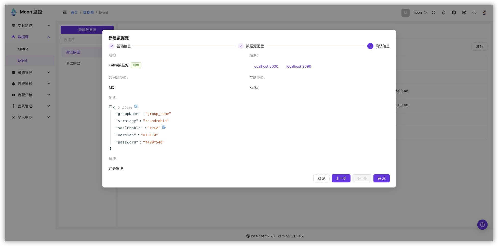

### 基本信息

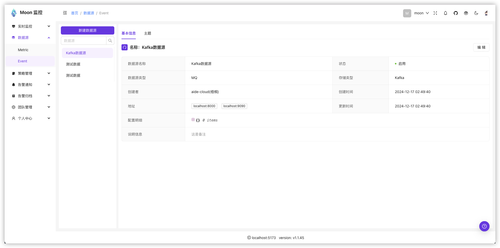

### 主题

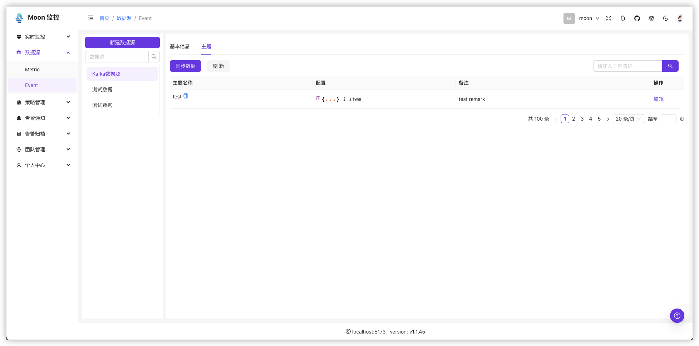
## 日志（Log）

实现统一的日志查询接口，以支持多种日志存储器。 在平台配置统一的日志策略完成日志类型数据的查询、分析、告警、可视化等。

```go
	// LogDatasource is the interface of log datasource.
	LogDatasource interface {
		// QueryLogs queries logs from datasource.
		QueryLogs(ctx context.Context, expr string, start, end int64) (*LogResponse, error)
		// Check checks
		Check(ctx context.Context) error
	}
```

- [Elasticsearch](https://www.elastic.co/cn/products/elasticsearch)：完整支持 ELK 技术栈，兼容 Kibana 可视化
- [Loki](https://grafana.com/oss/loki/)：优化日志索引存储，显著降低运维成本
- [aliyunSLS](https://www.aliyun.com/product/sls)：深度集成阿里云生态，支持一键接入云上服务
  三大主流日志存储方案，满足企业级用户在不同场景下的日志管理需求。
### 创建

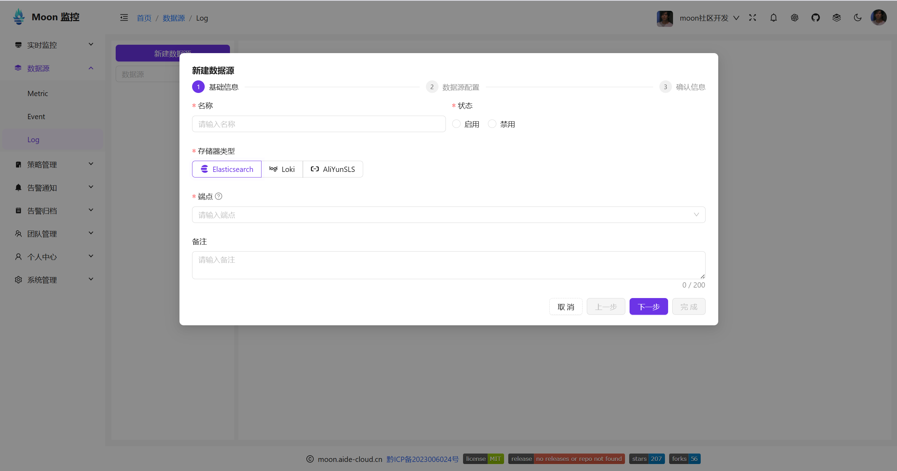
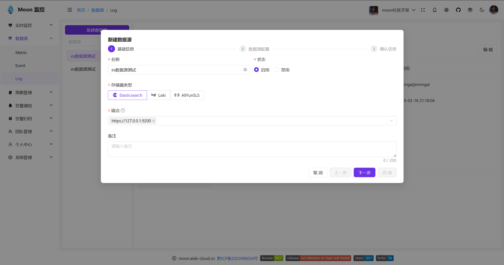
### 基本信息
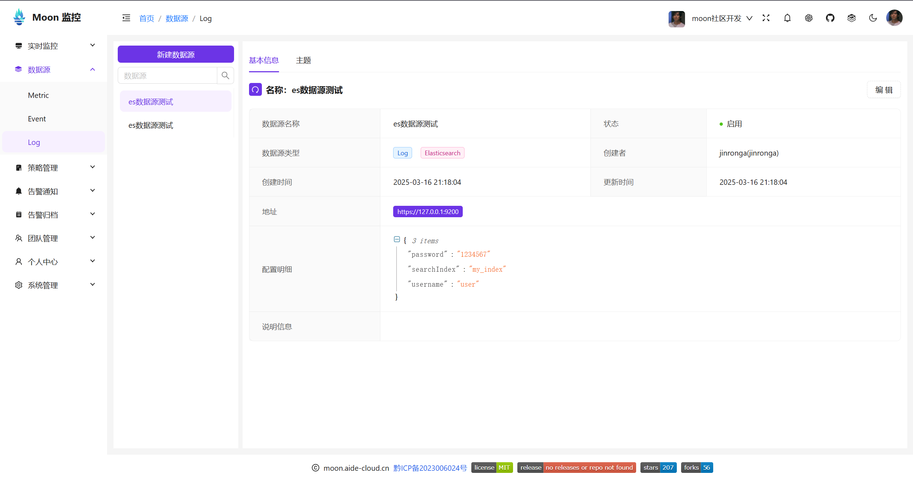

## 链路（Trace）- 开发中

链路数据源提供统一的分布式追踪数据接入和分析接口，支持主流的链路追踪系统，实现全链路监控、性能分析和故障诊断。

### 计划支持的追踪系统

1. **OpenTelemetry**
   - 开源可观测性标准
   - 统一的数据模型
   - 多语言SDK支持
   - 丰富的集成能力
   - 适用于云原生应用

2. **Jaeger**
   - 高扩展的分布式追踪系统
   - 细粒度的性能分析
   - 根因分析能力
   - 服务依赖分析
   - 适用于微服务架构

### 规划功能

1. **数据采集**
   - 自动埋点注入
   - 多协议接入
   - 采样率控制
   - 上下文传播
   - 异步追踪支持

2. **链路分析**
   - 全链路视图
   - 调用关系图
   - 性能瓶颈分析
   - 异常链路追踪
   - 服务依赖拓扑

3. **监控告警**
   - 链路延迟监控
   - 错误率告警
   - 异常链路检测
   - SLA违规告警
   - 基线智能告警

### 接口规划

```go
// TraceDatasource 链路数据源接口
type TraceDatasource interface {
    // QueryTrace 查询链路数据
    QueryTrace(ctx context.Context, traceID string) (*TraceData, error)
    
    // QueryTraces 批量查询链路
    QueryTraces(ctx context.Context, filter *TraceFilter) ([]*TraceData, error)
    
    // GetServiceGraph 获取服务调用关系图
    GetServiceGraph(ctx context.Context, start, end int64) (*ServiceGraph, error)
    
    // GetServiceMetrics 获取服务指标
    GetServiceMetrics(ctx context.Context, service string, start, end int64) (*ServiceMetrics, error)
}
```

### 开发计划

1. **第一阶段**
   - OpenTelemetry协议支持
   - 基础链路查询功能
   - 简单链路视图展示
   - 基本性能分析能力

2. **第二阶段**
   - Jaeger集成支持
   - 高级查询分析功能
   - 服务依赖分析
   - 链路告警支持

3. **第三阶段**
   - 多存储后端支持
   - AI智能分析
   - 链路基线管理
   - 全链路监控大盘
